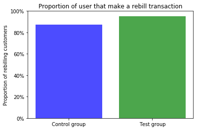
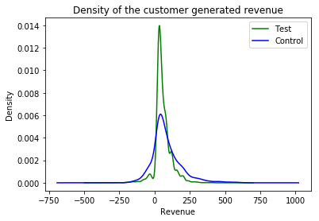

## Preliminary considerations

- In the uncertainty of the target audience of this reports, I assume a basic stats knowledge from the reader. I hope that it was what I was supposed to do.
- For me it was unclear what I was supposed to do with de customer that does not have any recorded transaction. I decided to removed them from the dataset for question 2,3,4 about transactional behaviour. This would be a good choice if for example they where randomized recently and we did not have the time to get transaction information about them. With more context, I may have take another decision.

## Question 1

What is the approximate probability distribution between the test group and the control group

__ANSWER:__ Since the group attribution is made following an unbalanced coins flip, it follows a Bernoulli distribution with probability $p$ of being in the test group. The probability $p$ is given by the expected value of the distribution. Therefore the parameter $p$ of the distribution is $0.2484 \pm 0.0035$, $95\%$ of the time.

## Question 2:
__Is a user that must call-in to cancel more likely to generate at least 1 addition REBILL?__

__ANSWER:__
A user that need to call in much more likely to make at least one rebill operation.

We first  determine using the transactions data if a user as conduct a rebill transaction. We conduct à chi squared test to test the independence between the group attribution and the presence of a  rebill transaction. The outcome is a p-value of almost zero. Therefore with very high probability being required to cancel by phone impact the likelihood et rebilling. Since the proportion of rebilling is higher in the test group (see the plot above), requiring to call for cancelling increase the chances of seeing a rebill transaction.

## Question 3
__Is a user that must call-in to cancel more likely to generate more revenues?__

__ANSWER:__
As we can see on the above plot, the control group has distribution with a larger variance that the test group. Moreover, the means of the revenue for the test group is $58.37\$$ but $83.26\$$ for the control group. Using central limit theorem, we can assume that Using a Welch's t-test, we can see that it is almost certainly a significant difference since the p-value is nearly $0$.

## Question 4
__Is a user that must call-in more likely to produce a higher chargeback rate(CHARGEBACKs/REBILLs)?__

__ANSWER:__
    With the current data it is not really possible to answer the question. Even if the mean is bigger for the test group, the p-value of 0.23 tells us to consider carefully the results. In fact the chargeback/rebill rates is zero for almost all our customer. To answer this question, more data collection is needed.
